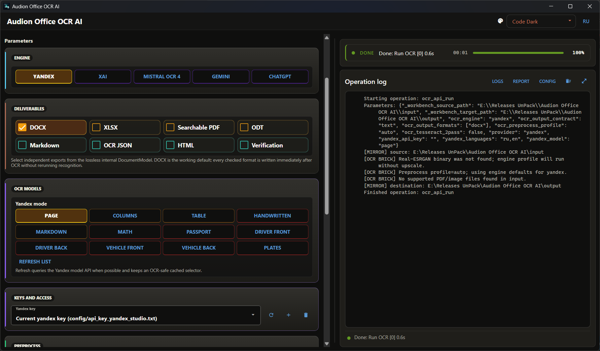

# Audion Office OCR AI

<!-- audion:release -->
<p align="center">
  <a href="https://audion.dev/downloads/office-ocr-ai"></a>
  <a href="https://github.com/Tensionix/office-ocr-ai/releases/latest"></a>
  <a href="https://github.com/Tensionix/office-ocr-ai/releases"></a>
  <a href="https://github.com/Tensionix/office-ocr-ai/blob/main/LICENSE"></a>
</p>

**Version 1.8.1** · 2026-09-04 · 971.7 MB

- [Direct download](https://audion.dev/get/office-ocr-ai/1.8.1/Audion_Office_OCR_AI_v1.8.1_Full.zip) — unmetered, no rate limits
- [Project page](https://audion.dev/downloads/office-ocr-ai) — every version and how to install

<p align="center"></p>

`SHA-256: ea27fcac1addf0c8e27bccd9ad1c1e189d9fc4202c4f683099ad2d5ace7ff940`

---

An **Audion** tool, published by [Tensionix](https://github.com/Tensionix).
<!-- /audion:release -->


[Русский](Docs/README_RU.md) · [User Guide](Docs/USER_GUIDE_EN.md) · [History](Docs/CHANGELOG_EN.md)

**Contents**

- [Why It Exists](#why-it-exists)
- [What Is in the Package](#what-is-in-the-package)
- [What Is Assembled From It](#what-is-assembled-from-it)
- [Principles](#principles)
- [Next](#next)
- [Technical Reference](#technical-reference)

Recognising scans and converting office documents: from paper to an editable
document, a spreadsheet, a searchable PDF, and everything else — from a single
recognition pass.

## Why It Exists

Recognition costs money and time. The usual workflow ignores that: you run a
scan, get a Word file — and a week later you need the spreadsheet. So you run it
again. Then you need a PDF with a text layer — once more.

Every pass means new money, a new queue, and a new result that may differ from
the previous one.

Here the order is different:

```
sources → recognition → document package → review → any format
```

**You pay for recognition once.** The result is stored in an independent
`<name>.document` package, and every format afterwards is assembled from it
locally — with no call to a paid service.

## What Is in the Package

Not the text, but everything the text came from:

* an exact copy of the original;
* images of every page before and after preprocessing;
* hashes;
* the text and coordinates of **all** recognition candidates, not just the chosen
  ones;
* reading order, tables, merged cells;
* confidence for every fragment;
* cross-checks between different engines;
* the provider's raw response;
* room for manual corrections.

**Completeness here means no loss of source data**, not a promise of flawless
recognition. A recognition error is visible and fixable precisely because
everything it was based on lies beside it.

## What Is Assembled From It

Eight results, independently and at once: DOCX, XLSX, PDF with a text layer, ODT,
Markdown, recognition JSON, HTML, and a review sheet.

By default only DOCX is produced — there are no format presets, nothing
superfluous is generated. Reassembly runs locally; no third-party office suite is
required. The maximum page size is A3.

## Principles

**The second pass by another engine is independent.** It receives the same
cleaned raster but does not see the first engine's text. So a disagreement
between them means genuine ambiguity, rather than a hint repeated back.

**Tables are parsed by a physical grid.** For ruled tables a grid is built from
the long lines of the raster, and the column count is verified against a `1…N`
numbering row taken from the coordinates of recognised words. Only then are the
engines compared inside exact cells.

Merges are restored **only in the header** — there they are predictable. In the
body of a table a merged cell more often means a parsing error than the author's
intent.

**Disagreements over digits are preserved.** If the engines read a number
differently, both readings stay in the package. A number is where a recognition
error costs most, and a person should settle it.

**Markdown is not the centre of the system.** It is convenient as a control
format and as input for language models, but the document package is not built
around it.

## Next

* [User Guide](Docs/USER_GUIDE_EN.md) — step by step.
* [History](Docs/CHANGELOG_EN.md) — what changed.

---

## Technical Reference

### Workbench Naming

The path rows are called **Source** and **Target**. The buttons are the same as in
every Audion project: **Source**, **Add file…**, **Target**, **Reset**,
**Delete**, **List**.

The source may be a single file or a folder. An external path is mirrored into
the managed working folder, and results are synchronised into the chosen target.

### Second Pass

| setting | what it does |
|---|---|
| none | the main engine only |
| Tesseract | local cross-check |
| Yandex | cloud cross-check |
| Yandex and Tesseract | both |

### Full Archive

Packing the whole package into one archive remains an engine capability for
compatibility, but it is not shown among the main buttons: it is rarely needed and
takes a great deal of space.
